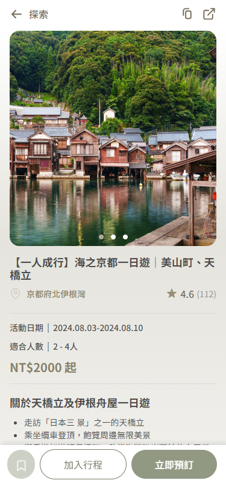
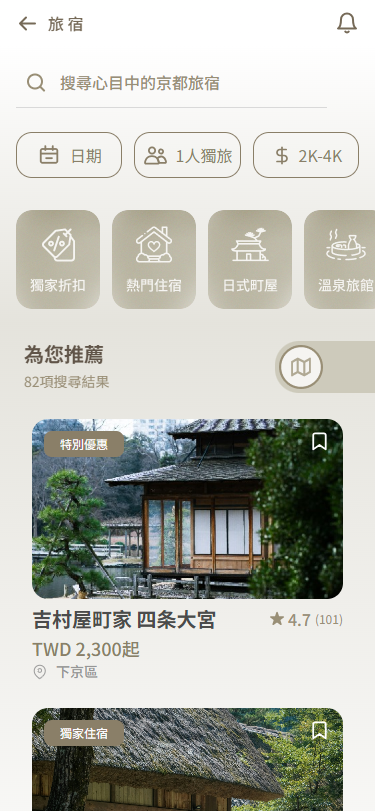
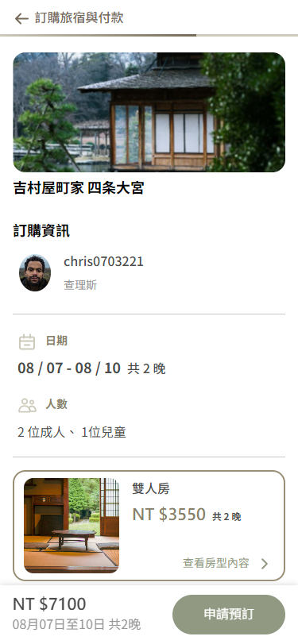

# 京都散策 APP

* [GitHub repo](https://github.com/oriascrius/aapd/tree/gh-pages)
* [gh-pages](https://oriascrius.github.io/aapd/)

---

## 設計師 APPD 團隊

---

## 程式專題作者

  - [泊岸](https://github.com/oriascrius): 前端開發
  - [Chewsday](): 前端開發
  - [翎光乍現](): 前端開發

---

## 前端技術

---

## 設計軟體

## 溝通、協作

---

##  網站導覽
### 首頁

### 導覽五區塊
#### 導覽五區塊 - 探索

#### 導覽五區塊 - 旅宿

#### 導覽五區塊 - 旅遊行程

#### 導覽五區塊 - 社群

#### 導覽五區塊 - 個人

### 探索細項

.png)

### 旅宿細項

.png)

---

<!-- ### 特別感謝 - 專題指導
  - 六角學院 / 卡斯柏 老師
  - 專題教練 / [樂樂 教練](https://github.com/PinyiW0)
  - 六角學院 / 助教群

--- -->

### 圖片素材來源
- [Midjourney](https://www.midjourney.com/home)
- [Pixels](https://www.pexels.com/zh-tw/)
- [Unsplash](https://unsplash.com/)

---

本專題僅為學習用途,不做任何商業使用

---